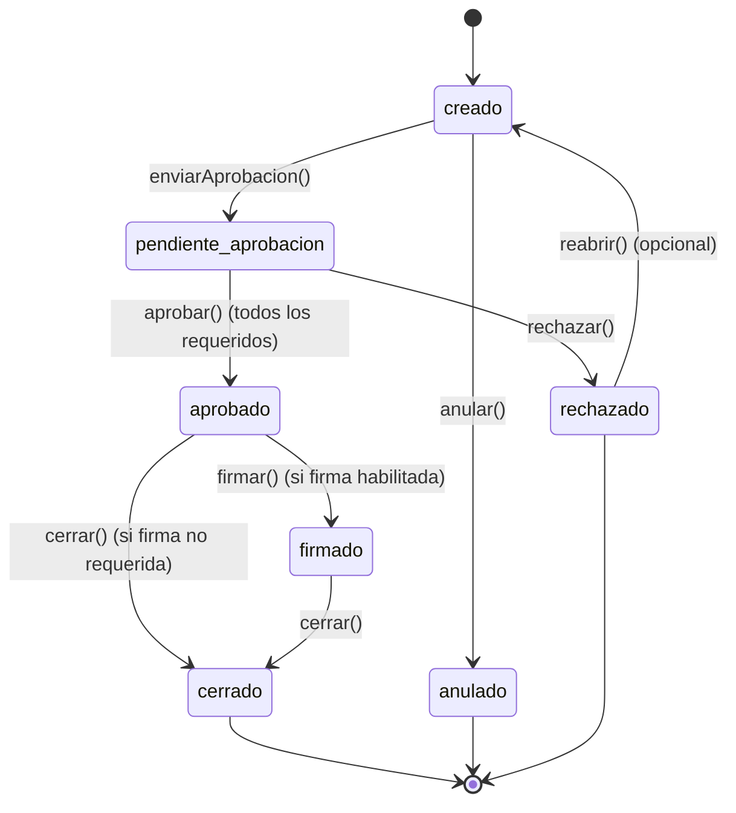

# Arquitectura Propuesta: Flujo de Documentos con “Sobres” + Migración a Firebase (Firestore)

## 1. Objetivo
Estandarizar y escalar el flujo de registro de cobranzas en conciliapp mediante:
- Introducción del concepto de “Sobre” (Envelope) para agrupar documentos (facturas).
- Gestión de estados y auditoría robusta.
- Migración progresiva desde Google Sheets a Firestore (sin romper lo existente).
- Preparación para futura integración con firma electrónica externa (DocuSign u otra).
- Asegurar consistencia, integridad (hashes) y trazabilidad.

---

## 2. Resumen Ejecutivo
La aplicación actual escribe registros directamente en la hoja “Respuestas”. Con la expansión del uso (múltiples facturas por transacción, aprobación, firma), el modelo plano se queda corto.  
La propuesta introduce una capa intermedia (Sobres) persistida en Firestore, controlando estados y generando un único registro final en “Respuestas” sólo al cierre del sobre (o marcando esa hoja como legado, más adelante).

---

## 3. Arquitectura Actual (Simplificada)
- Frontend: HTML/JS (Apps Script UIService/HtmlService).
- Backend: Google Apps Script (GAS) con funciones expuestas (`enviarDatos`, `obtenerFacturas`, etc.).
- Persistencia: Google Sheets (hojas “Respuestas”, origen de clientes/facturas).
- Autenticación: Token “manual” (probablemente validación simple/Apps Script).
- Limitaciones:
  - No hay estados intermedios (borrador/aprobado).
  - No existe auditoría detallada.
  - Difícil escalar a flujos de firma.
  - Concurrencia limitada (race conditions en setValues).
  - No hay integridad criptográfica.

---

## 4. Arquitectura Objetivo (Fase Completa)
Componentes:
- Firestore (colecciones: `envelopes`, `envelopeEvents`, `users`, `configs`, opcional `documents`).
- Cloud Functions (validación de transiciones, triggers de auditoría, hash).
- Apps Script Frontend -> llama a un endpoint intermedio (HTTP Cloud Function) o directamente a Firestore vía REST (con token).
- Google Sheets:
  - Rol 1: Fuente de datos transitorios (clientes/facturas) mientras no se migre.
  - Rol 2 (temporal): Repositorio final hasta reemplazo por reporte dinámico Firestore + BigQuery export opcional.
- Hash integridad: HMAC almacenado en cada envelope.
- Seguridad: Reglas Firestore + Custom Claims (roles).
- Observabilidad: Logs en Cloud Logging + auditoría en `envelopeEvents`.

---

## 5. Flujo de Estados del Sobre



Reglas:
- No se puede modificar `facturasCsv` tras `pendiente_aprobacion` sin volver a `creado`.
- `cerrado` bloquea todas las mutaciones excepto lectura/auditoría.
- `anulado` y `rechazado` son terminales (salvo reabrir explícito en política interna).

---

## 6. Modelo de Datos Firestore

### 6.1 Colección `envelopes` (Documento)
```json
{
  "id": "SOB-2025-000123",            // (igual a doc.id)
  "creatorEmail": "vendedor@dom.com",
  "createdAt": "2025-09-11T15:10:00.123Z",
  "updatedAt": "2025-09-11T15:10:00.123Z",
  "status": "creado",                 // creado|pendiente_aprobacion|aprobado|firmado|cerrado|rechazado|anulado
  "participants": {
    "approvers": ["admin@dom.com"],
    "signers": ["finanzas@dom.com"],
    "watchers": []
  },
  "requiredApprovals": 1,
  "approvals": {
    "admin@dom.com": {
      "approvedAt": "2025-09-11T15:15:10.500Z",
      "decision": "approve"           // approve|reject
    }
  },
  "facturasCsv": "ET00152326,ET00152327,ET00152328",
  "montoTotal": 14630.95,
  "moneda": "USD",
  "referenciaPago": "672848100152",
  "tipoCobro": "Cobro Total",
  "fechaPago": "2025-09-08",
  "observaciones": "",
  "hashContenido": "base64(hmac(...))",
  "firma": {                          // presente solo si firma requerida
    "signedBy": "finanzas@dom.com",
    "signedAt": "2025-09-11T15:20:00.000Z",
    "signatureHash": "..."
  },
  "closeMetadata": {
    "closedAt": null,
    "closedBy": null,
    "respuestaRowId": null            // id o referencia al registro final legacy (si se mantiene)
  },
  "integrityVersion": 1,
  "historyCompact": [
    "CREAR@2025-09-11T15:10Z",
    "APROBAR@2025-09-11T15:15Z"
  ],
  "configFlags": {
    "firmaObligatoria": true
  }
}
```

### 6.2 Colección `envelopeEvents`
```json
{
  "envelopeId": "SOB-2025-000123",
  "timestamp": "2025-09-11T15:15:10.500Z",
  "actor": "admin@dom.com",
  "action": "APROBAR",                 // CREAR|ENVIAR_APROBACION|APROBAR|RECHAZAR|FIRMAR|CERRAR|ANULAR|REABRIR|UPDATE
  "detail": {
    "oldStatus": "pendiente_aprobacion",
    "newStatus": "aprobado"
  },
  "hashAnterior": "abcd...",
  "hashNuevo": "efgh..."
}
```

### 6.3 Colección `users`
```json
{
  "email": "admin@dom.com",
  "roles": ["ADMIN","APPROVER"],  // complementado con custom claims
  "active": true,
  "createdAt": "..."
}
```

### 6.4 (Opcional) `documents`
Si luego adjuntas PDFs / comprobantes:
```json
{
  "envelopeId": "SOB-2025-000123",
  "type": "PDF_FACTURAS",
  "storagePath": "gs://bucket/sobres/SOB-2025-000123/facturas.pdf",
  "hash": "...",
  "uploadedAt": "..."
}
```

---

## 7. Cálculo de Hash de Integridad
Campos núcleo recomendados para hash:
```
hashBase = `${facturasCsv}|${montoTotal}|${moneda}|${referenciaPago||''}|${fechaPago||''}|${tipoCobro||''}`
hash = HMAC_SHA256(secretKey, hashBase) -> Base64
```
- `secretKey`: almacenada en Secret Manager (no en código).
- Recalcular en cada transición que modifique campos núcleo.
- Registrar en `envelopeEvents`.

---

## 8. Reglas de Seguridad Firestore (Ejemplo)

```javascript
rules_version = '2';
service cloud.firestore {
  match /databases/{database}/documents {

    function isSignedIn() {
      return request.auth != null;
    }

    function hasRole(role) {
      return isSignedIn() && role in request.auth.token.roles;
    }

    match /envelopes/{id} {
      allow read: if isSignedIn() && (
          hasRole('ADMIN') ||
          request.auth.token.email == resource.data.creatorEmail ||
          request.auth.token.email in resource.data.participants.approvers ||
          request.auth.token.email in resource.data.participants.signers
      );

      // Crear sobre
      allow create: if isSignedIn();

      // Actualizaciones controladas
      allow update: if isSignedIn() && isValidTransition();

      // Bloquear delete (sólo admin podría, si lo consideras)
      allow delete: if false;

      function isValidTransition() {
        let old = resource.data;
        let neu = request.resource.data;

        // Evitar cambios tras cierre
        if (old.status == 'cerrado') return false;

        // Restringir cambio de facturasCsv si ya no está en 'creado' o 'rechazado'
        if (old.status != 'creado' && old.status != 'rechazado' && old.facturasCsv != neu.facturasCsv) {
          return false;
        }

        // Solo admin puede anular
        if (neu.status == 'anulado' && !hasRole('ADMIN')) {
          return false;
        }

        // Aprobación: actor debe estar en approvers
        if (old.status == 'pendiente_aprobacion' && neu.status == 'aprobado') {
          return request.auth.token.email in old.participants.approvers;
        }

        return true;
      }
    }

    match /envelopeEvents/{eventId} {
      allow read: if isSignedIn();
      allow create: if false; // Se crean sólo desde Cloud Function (useAdminSdk)
    }

    match /users/{u} {
      allow read: if hasRole('ADMIN');
      allow write: if hasRole('ADMIN');
    }
  }
}
```

---

## 9. Cloud Functions (Tipos)

| Tipo | Descripción | Trigger |
|------|-------------|---------|
| `onEnvelopeWrite` | Valida transición, recalcula hash, genera evento | Firestore onWrite(envelopes) |
| `closeEnvelope` | Genera fila en Sheets (o Firestore report) al cerrar | Firestore onUpdate (status→cerrado) |
| `generatePdf` (opcional) | Construye PDF consolidado y guarda en Storage | Pub/Sub / Callable |
| `rebuildHash` | Recalcula hashes masivamente (migraciones) | Manual (HTTP protected) |
| `assignRoles` | Asigna custom claims a usuarios | Callable (admin only) |

Ejemplo (Node.js 18+):
```javascript
exports.onEnvelopeWrite = functions.firestore
  .document('envelopes/{id}')
  .onWrite(async (change, ctx) => {
    const after = change.after.exists ? change.after.data() : null;
    const before = change.before.exists ? change.before.data() : null;
    if (!after) return;

    // Detectar cambios núcleo
    const coreFields = ['facturasCsv','montoTotal','moneda','referenciaPago','fechaPago','tipoCobro'];
    let changed = false;
    for (const f of coreFields) {
      if (!before || before[f] !== after[f]) { changed = true; break; }
    }

    if (changed) {
      const hashBase = `${after.facturasCsv}|${after.montoTotal}|${after.moneda}|${after.referenciaPago||''}|${after.fechaPago||''}|${after.tipoCobro||''}`;
      const secret = await fetchSecret('ENVELOPE_HASH_KEY');
      const hmac = createHmac('sha256', secret).update(hashBase).digest('base64');
      await change.after.ref.update({
        hashContenido: hmac,
        updatedAt: new Date().toISOString()
      });
    }

    // Log de evento (si estado cambió)
    if (before && before.status !== after.status) {
      await admin.firestore().collection('envelopeEvents').add({
        envelopeId: ctx.params.id,
        timestamp: new Date().toISOString(),
        actor: after._lastActor || 'system',
        action: after.status.toUpperCase(),
        detail: { oldStatus: before.status, newStatus: after.status }
      });
    }
  });
```

---

## 10. Integración con Google Apps Script (Frontend Actual)

### Opciones de Acceso a Firestore:
1. Vía Cloud Function HTTP (token de sesión -> intercambiado por Firebase custom token).
2. Vía REST Firestore (requiere JWT de servicio — menos recomendado en cliente).
3. Mantener parte del backend en GAS y delegar a HTTP Cloud Functions.

Recomendado (transición suave):
- GAS sirve la UI.
- GAS obtiene un custom token (llamando a CF con API Key interna).
- JS en el frontend inicializa Firebase (Web SDK) y opera sobre `envelopes`.

### Pasos en UI:
- Reemplazar “Enviar” por:
  - “Guardar Sobre” (estado: creado).
  - “Enviar a Aprobación”.
  - “Cerrar Sobre” (si ya aprobado/firma no requerida).
- Mostrar tabla Sobres (consulta Firestore: `where("creatorEmail","==",currentUser)` + filtros por estado).

---

## 11. Estrategia de Migración

| Fase | Objetivo | Cambios Usuario | Riesgo |
|------|----------|-----------------|--------|
| 0 | Base actual + multi-factura (CSV) | Mínimo | Bajo |
| 1 | Introducir colección `envelopes` y crear sobres en paralelo (sin cerrar) | Nueva pestaña “Sobres” | Bajo |
| 2 | Flujo de aprobación (status → cerrado crea fila en Sheets) | Usuarios aprueban | Medio |
| 3 | Eliminar escritura directa a “Respuestas” (solo sobres) | Ajuste hábito | Medio |
| 4 | Reemplazar reportes por consultas Firestore agregadas | Vista nueva | Medio |
| 5 | Firma interna / externa | Nueva acción | Medio/Alto |
| 6 | Desacoplar Sheets completamente (solo export histórico) | Transparente | Bajo |

---

## 12. Sincronización Temporal con Sheets
Mientras “Respuestas” siga activa:
- Cloud Function `closeEnvelope` crea la fila (legado).
- Añadir campo `idSobre` en la fila para trazabilidad.
- Eventualmente se reemplaza por una vista generada desde Firestore (BigQuery export + Data Studio / Looker Studio / direct query).

---

## 13. Auditoría y Observabilidad
- `envelopeEvents`: timeline auditable.
- Cloud Logging: eventos críticos (aprobaciones, rechazos, cierre).
- Hash de contenido: detectar manipulación.
- (Opcional) Export automático a BigQuery (para queries históricas).

---

## 14. Reglas de Indexado Firestore
Índices compuestos sugeridos:
- `status` + `creatorEmail`
- `status` + `updatedAt`
- `participants.approvers` (array-contains) + `status`
- `fechaPago` + `status`
- (Si buscas por referenciaPago) `referenciaPago` + `status`

Archivo `firestore.indexes.json` ejemplo:
```json
{
  "indexes": [
    {
      "collectionGroup": "envelopes",
      "queryScope": "COLLECTION",
      "fields": [
        { "fieldPath": "status", "order": "ASCENDING" },
        { "fieldPath": "updatedAt", "order": "DESCENDING" }
      ]
    },
    {
      "collectionGroup": "envelopes",
      "queryScope": "COLLECTION",
      "fields": [
        { "fieldPath": "status", "order": "ASCENDING" },
        { "fieldPath": "creatorEmail", "order": "ASCENDING" }
      ]
    }
  ]
}
```

---

## 15. Costos y Cuotas (Estimación Simplificada)
| Concepto | Uso Estimado | Observación |
|----------|--------------|-------------|
| Firestore Lecturas | 5–10 por sobre (lista + detalle + eventos) | Optimizar con caching local |
| Firestore Escrituras | 3–8 por sobre (creación, transiciones) | Batches cuando sea posible |
| Almacenamiento | Bajo (JSON ligero) | PDFs aumentan costo |
| Cloud Functions invocaciones | 1–4 por sobre | Debounce en onWrite |
| BigQuery export (opcional) | Incremental | Evaluar después de volumen > 50K sobres |

Optimización:
- Consolidar mutaciones en `update` único cuando sea viable.
- Usar `historyCompact` para vista rápida y cargar `envelopeEvents` on-demand.

---

## 16. Versionado y Entornos
| Entorno | Proyecto Firebase | Reglas | Datos |
|---------|-------------------|--------|-------|
| Dev | conciliapp-dev | Reglas permisivas + logging | Datos sintéticos |
| Staging | conciliapp-staging | Casi productivas | Copia parcial enmascarada |
| Prod | conciliapp-prod | Estrictas | Datos reales |

Deployment:
- `firebase use <alias>` + `firebase deploy --only firestore:rules,functions`
- CI/CD opcional (GitHub Actions).

---

## 17. Plan de Pruebas (Resumen)

### Unitarias (Cloud Functions)
- Transición inválida (aprobado → creado) rechazada.
- Hash recalculado al cambiar monto.
- Evento generado en cada cambio de estado.

### Integración
- Crear → Enviar aprobación → Aprobar → Cerrar (ciclo feliz).
- Rechazar en pendiente_aprobacion.
- Anular desde creado (rol admin).
- Intentar modificar facturasCsv después de pendiente_aprobacion (fallo).

### UI/UX
- Filtrar sobres por estado.
- Render condicional de botones según rol/estado.

### Seguridad
- Usuario sin rol no puede aprobar.
- Usuario sin relación no puede leer sobre ajeno.
- Cambiar status manual vía consola → bloqueado por reglas.

---

## 18. Roadmap (Fechas Referenciales)

| Semana | Hito |
|--------|------|
| 1 | Crear colecciones, reglas iniciales, EnvelopeService (GAS + CF) |
| 2 | UI básica: listado y creación sobres |
| 3 | Flujo aprobación + cierre → escritura en Sheets |
| 4 | Firma interna y hashing robusto |
| 5 | Migrar reportes a Firestore + export BigQuery |
| 6 | Desactivar envío directo (solo sobres) |
| 7+ | Evaluar firma avanzada / DocuSign |

---

## 19. Riesgos y Mitigaciones

| Riesgo | Mitigación |
|--------|------------|
| Doble escritura (hoja y Firestore) | Bandera `closed` + idSobre en fila |
| Errores de transición | Máquina de estados central en CF |
| Hash inconsistente | Función única para cálculo + tests |
| Escalada de costos Firestore | Monitoreo mensual + caching |
| Fuga de roles | Custom claims controlados por Admin UI mínima |
| Latencia inicial (primera carga) | Prefetch + skeleton UI |

---

## 20. Checklist de Implementación (Fase 1–3)

- [ ] Crear proyecto Firebase / habilitar Firestore (modo producción).
- [ ] Configurar roles y custom claims (script admin).
- [ ] Definir `firestore.rules` y `firestore.indexes.json`.
- [ ] Implementar Cloud Function `onEnvelopeWrite`.
- [ ] Implementar endpoints callable/HTTP para: create, sendForApproval, approve, reject, close.
- [ ] Adaptar frontend (Apps Script) para crear y listar sobres.
- [ ] Añadir capa token Firebase (custom token issuance) en GAS.
- [ ] Añadir cálculo de hash (HMAC) con Secret Manager.
- [ ] Registrar eventos en `envelopeEvents`.
- [ ] Cerrar sobre → escribir fila en “Respuestas” (legacy).
- [ ] Pruebas unitarias CF (Jest).
- [ ] Pruebas integración (ciclo completo).
- [ ] Documentar fallback si Firestore falla (modo degradado).
- [ ] Preparar script migración histórica (opcional).

---

## 21. Ejemplo de Código Frontend (Inicialización Firebase en Apps Script UI)

```html
<script src="https://www.gstatic.com/firebasejs/10.12.0/firebase-app-compat.js"></script>
<script src="https://www.gstatic.com/firebasejs/10.12.0/firebase-firestore-compat.js"></script>
<script src="https://www.gstatic.com/firebasejs/10.12.0/firebase-auth-compat.js"></script>
<script>
  const firebaseConfig = {
    apiKey: "<PUBLIC_API_KEY>",
    authDomain: "conciliapp-prod.firebaseapp.com",
    projectId: "conciliapp-prod"
  };
  firebase.initializeApp(firebaseConfig);
  const db = firebase.firestore();

  // tokenFirebase obtenido vía google.script.run (custom token)
  async function signInWithCustomToken(tokenFirebase) {
    await firebase.auth().signInWithCustomToken(tokenFirebase);
  }

  async function crearSobre(payload) {
    const ref = await db.collection('envelopes').add({
      ...payload,
      status: 'creado',
      createdAt: new Date().toISOString(),
      updatedAt: new Date().toISOString(),
      creatorEmail: currentUserEmail
    });
    return ref.id;
  }

  async function listarMisSobres() {
    const snap = await db.collection('envelopes')
      .where('creatorEmail', '==', currentUserEmail)
      .orderBy('updatedAt', 'desc')
      .limit(50)
      .get();
    return snap.docs.map(d => ({ id: d.id, ...d.data() }));
  }
</script>
```

---

## 22. Conclusión
Esta estructura permite escalar conciliapp:
- De un registro plano a un workflow gobernado.
- De almacenamiento frágil a backend transaccional y auditable.
- Preparando la puerta a firmas electrónicas y reporting avanzado.

Próximo paso recomendado: Implementar Fase 1 (colecciones + creación de sobres) y validar con un subconjunto reducido de usuarios antes de activar aprobación.

---

¿Necesitas un PR inicial con la estructura Firestore + EnvelopeService (versión pseudo-código en GAS) o un script de creación de reglas? Indícalo y lo preparo.
