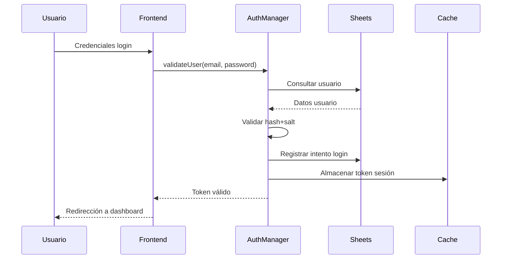
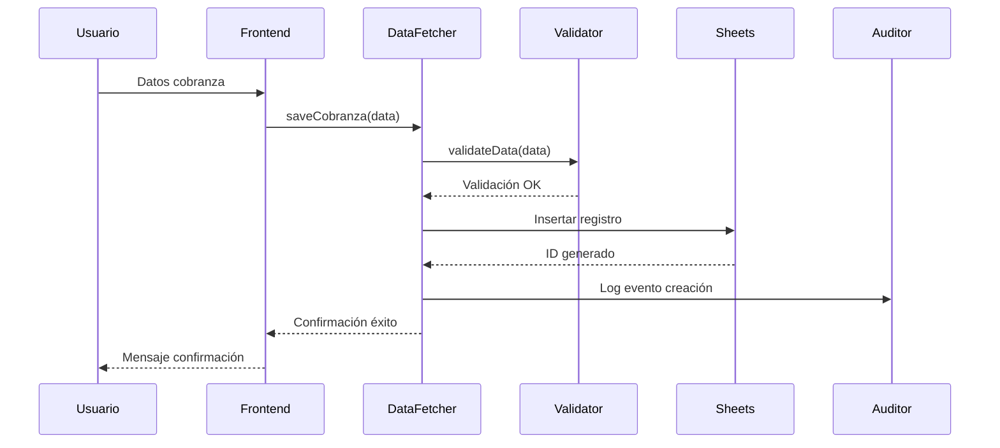
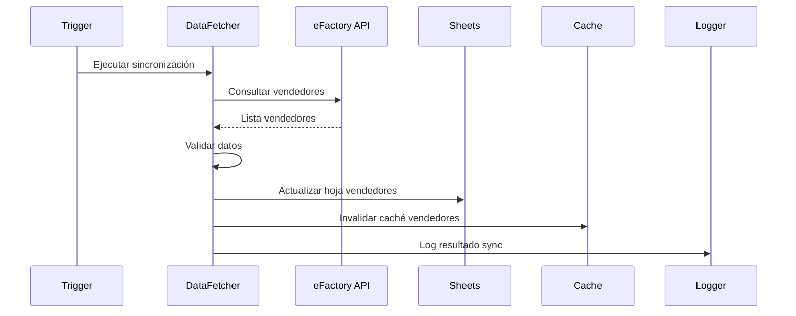

# Arquitectura del Sistema - Conciliapp

Este documento describe la arquitectura general del sistema Conciliapp, un sistema de registro de cobranzas desarrollado sobre Google Apps Script.

## Visión Arquitectónica

### Objetivos del Sistema
- Proporcionar una plataforma segura para el registro de cobranzas
- Mantener integridad y trazabilidad de datos financieros
- Soportar 50-100 usuarios concurrentes con buena performance
- Facilitar auditoría y generación de reportes
- Preparar migración futura a arquitectura más escalable (Firestore)

### Principios Arquitectónicos
- **Simplicidad**: Aprovechar herramientas existentes de Google Workspace
- **Seguridad**: Autenticación robusta y auditoría completa
- **Mantenibilidad**: Código modular y bien documentado
- **Escalabilidad**: Diseño que permita futuras migraciones
- **Confiabilidad**: Manejo robusto de errores y recuperación

## Arquitectura Actual (Sheets-based)

### Vista de Alto Nivel

```
┌─────────────────┐    ┌─────────────────┐    ┌─────────────────┐
│   Navegador     │    │  Google Apps    │    │  Google Sheets  │
│   (Frontend)    │◄──►│    Script       │◄──►│  (Database)     │
│                 │    │  (Backend)      │    │                 │
└─────────────────┘    └─────────────────┘    └─────────────────┘
                              │
                              ▼
                       ┌─────────────────┐
                       │   APIs Externas │
                       │   (eFactory)    │
                       └─────────────────┘
```

### Componentes Principales

#### 1. Frontend (HTML/JavaScript)
- **auth.html**: Página de autenticación (login/registro)
- **index.html**: Interfaz principal de registro de cobranzas
- **dashboard.html**: Panel administrativo (opcional)

#### 2. Backend (Google Apps Script)
- **codigo.js**: Lógica principal de negocio
- **auth.js**: Gestión de autenticación y autorización
- **maintenance.js**: Servicios de mantenimiento y optimización

#### 3. Persistencia (Google Sheets)
- **Respuestas**: Registros principales de cobranza
- **Usuarios**: Información de usuarios y credenciales
- **Auditoria**: Log de eventos y acciones del sistema
- **obtenerVendedoresPorUsuario**: Catálogo de vendedores autorizados
- **Registros Eliminados**: Registros borrados con auditoría

### Patrones Arquitectónicos Utilizados

#### Patrón Service Layer
```javascript
// Ejemplo: AuthManager como servicio
const AuthManager = {
  validateUser: function(email, password) { /* ... */ },
  generateToken: function(user) { /* ... */ },
  checkPermissions: function(user, action) { /* ... */ }
};
```

#### Patrón Repository (simplificado)
```javascript
// Ejemplo: DataFetcher como repositorio
const DataFetcher = {
  getVendedores: function() { /* consulta a Sheet */ },
  saveRegistro: function(data) { /* escritura a Sheet */ },
  updateUsuario: function(id, data) { /* actualización */ }
};
```

#### Patrón Cache-Aside
```javascript
// Ejemplo: CacheManager
const CacheManager = {
  get: function(key) {
    let value = CacheService.getScriptCache().get(key);
    if (!value) {
      value = this.loadFromSource(key);
      this.set(key, value);
    }
    return value;
  }
};
```

## Arquitectura de Componentes Detallada

### Módulo AuthManager

```
┌─────────────────────────────────────────────────────────────┐
│                     AuthManager                             │
├─────────────────────────────────────────────────────────────┤
│ + validateUser(email, password): Boolean                    │
│ + registerUser(userData): Result                            │
│ + generateToken(user): String                               │
│ + validateToken(token): User                                │
│ + logLoginAttempt(email, success, details): void            │
│ + checkRateLimit(email): Boolean                            │
├─────────────────────────────────────────────────────────────┤
│ - hashPassword(password, salt): String                      │
│ - generateSalt(): String                                    │
│ - isUserAuthorized(email): Boolean                          │
└─────────────────────────────────────────────────────────────┘
```

**Responsabilidades:**
- Autenticación segura con HMAC-SHA256
- Gestión de tokens de sesión
- Rate limiting y prevención de ataques
- Auditoría de accesos

### Módulo DataFetcher

```
┌─────────────────────────────────────────────────────────────┐
│                     DataFetcher                             │
├─────────────────────────────────────────────────────────────┤
│ + getVendedores(): Array<Vendedor>                          │
│ + getClientes(): Array<Cliente>                             │
│ + saveCobranza(data): Result                                │
│ + getRegistrosByUser(email): Array<Registro>                │
│ + deleteRegistro(id, user): Result                          │
│ + syncVendedoresFromAPI(): Result                           │
├─────────────────────────────────────────────────────────────┤
│ - validateData(data): ValidationResult                      │
│ - generateId(): String                                      │
│ - formatData(raw): Object                                   │
└─────────────────────────────────────────────────────────────┘
```

**Responsabilidades:**
- CRUD operations en Google Sheets
- Sincronización con APIs externas
- Validación de datos
- Transformación de formatos

### Módulo CacheManager

```
┌─────────────────────────────────────────────────────────────┐
│                    CacheManager                             │
├─────────────────────────────────────────────────────────────┤
│ + get(key): Any                                             │
│ + set(key, value, ttl): void                                │
│ + invalidate(key): void                                     │
│ + clear(): void                                             │
│ + getStats(): CacheStats                                    │
├─────────────────────────────────────────────────────────────┤
│ - isExpired(timestamp, ttl): Boolean                        │
│ - serialize(data): String                                   │
│ - deserialize(data): Any                                    │
└─────────────────────────────────────────────────────────────┘
```

**Responsabilidades:**
- Optimización de consultas frecuentes
- Gestión de tokens de sesión
- Reducción de quota usage
- Performance monitoring

### Módulo MaintenanceService

```
┌─────────────────────────────────────────────────────────────┐
│                 MaintenanceService                          │
├─────────────────────────────────────────────────────────────┤
│ + enableMaintenanceMode(reason): void                       │
│ + disableMaintenanceMode(): void                            │
│ + cleanExpiredTokens(): void                                │
│ + createBackup(): Result                                    │
│ + generateHealthReport(): HealthReport                      │
│ + optimizePerformance(): void                               │
├─────────────────────────────────────────────────────────────┤
│ - isMaintenanceEnabled(): Boolean                           │
│ - archiveOldData(): void                                    │
│ - validateDataIntegrity(): ValidationResult                 │
└─────────────────────────────────────────────────────────────┘
```

**Responsabilidades:**
- Tareas de mantenimiento programadas
- Backup y recuperación
- Monitoreo de salud del sistema
- Optimización automática

## Modelo de Datos

### Entidades Principales

#### Usuario
```
{
  email: String (PK),
  password_hash: String,
  salt: String,
  fecha_registro: Date,
  ultimo_login: Date,
  intentos_fallidos: Number,
  bloqueado_hasta: Date?
}
```

#### Registro de Cobranza
```
{
  id: String (PK),
  timestamp: Date,
  email_usuario: String (FK),
  cliente: String,
  vendedor: String,
  facturas: String (CSV),
  monto: Number,
  metodo_pago: String,
  estado: String
}
```

#### Evento de Auditoría
```
{
  id: String (PK),
  timestamp: Date,
  usuario: String,
  accion: String,
  detalles: String,
  ip: String?,
  user_agent: String?,
  resultado: String
}
```

### Relaciones de Datos

```
Usuario (1) ──────── (N) Registro_Cobranza
Usuario (1) ──────── (N) Evento_Auditoria
Vendedor (1) ────── (N) Registro_Cobranza
Cliente (1) ─────── (N) Registro_Cobranza
```

## Flujos de Datos

### Flujo de Autenticación



### Flujo de Registro de Cobranza



### Flujo de Sincronización



## Seguridad

### Modelo de Seguridad

#### Autenticación
- **Hash Algorithm**: HMAC-SHA256 con salt único por usuario
- **Session Management**: Tokens con TTL de 6 horas
- **Rate Limiting**: Máximo 5 intentos fallidos con bloqueo temporal
- **Audit Trail**: Registro completo de todos los accesos

#### Autorización
- **Role-Based**: Usuarios normales vs administradores
- **Resource-Based**: Solo acceso a registros propios
- **Action-Based**: Diferentes permisos según operación

#### Protección de Datos
- **Encryption at Rest**: Datos sensibles en PropertiesService
- **Input Validation**: Sanitización en frontend y backend
- **SQL Injection Protection**: Queries parametrizadas (Apps Script)
- **XSS Prevention**: Validación y escape de outputs

### Amenazas y Mitigaciones

| Amenaza | Mitigación |
|---------|------------|
| Brute Force Login | Rate limiting + account lockout |
| Session Hijacking | Short-lived tokens + secure storage |
| Data Injection | Input validation + sanitization |
| Unauthorized Access | Permission checks + audit logs |
| Data Corruption | Backups + transaction integrity |

## Performance y Escalabilidad

### Límites Actuales de Google Apps Script

| Recurso | Límite Diario | Límite por Ejecución |
|---------|---------------|---------------------|
| Execution time | 6 horas | 6 minutos |
| Triggers | 20 | - |
| Email sends | 100 | - |
| UrlFetch calls | 20,000 | - |
| Script runtime | 6 horas | 6 minutos |

### Estrategias de Optimización

#### Caching
- Caché de datos estáticos (vendedores, clientes)
- Caché de sesiones de usuario
- Invalidación inteligente de caché

#### Consultas Eficientes
- Consultas por rangos específicos
- Paginación en listados grandes
- Índices implícitos en Sheets

#### Gestión de Quota
- Monitoring de uso diario
- Throttling de operaciones costosas
- Fallbacks para casos de quota exhausted

### Métricas de Performance

| Métrica | Objetivo | Actual |
|---------|----------|--------|
| Tiempo de login | < 2 segundos | ~1.5 segundos |
| Tiempo registro cobranza | < 3 segundos | ~2 segundos |
| Tiempo carga inicial | < 5 segundos | ~4 segundos |
| Disponibilidad | > 99% | ~99.5% |

## Arquitectura Objetivo (Firestore)

### Visión Futura

La migración a Firestore permitirá:
- Escalabilidad real-time
- Mejor performance y concurrencia
- Capacidades de query más avanzadas
- Integración nativa con otros servicios GCP

### Componentes de la Migración

```
┌─────────────────┐    ┌─────────────────┐    ┌─────────────────┐
│   Frontend      │    │   Cloud         │    │   Firestore     │
│   (React/Vue)   │◄──►│   Functions     │◄──►│   Database      │
│                 │    │                 │    │                 │
└─────────────────┘    └─────────────────┘    └─────────────────┘
                              │
                              ▼
                       ┌─────────────────┐
                       │   External      │
                       │   APIs          │
                       └─────────────────┘
```

### Plan de Migración por Fases

#### Fase 1: Migración de Backend
- Migrar lógica de negocio a Cloud Functions
- Mantener frontend actual como bridge
- Implementar sync bidireccional Sheets ↔ Firestore

#### Fase 2: Migración de Base de Datos
- Migrar datos históricos a Firestore
- Implementar nuevas features solo en Firestore
- Deprecar gradualmente dependencias de Sheets

#### Fase 3: Migración de Frontend
- Reescribir frontend en framework moderno
- Aprovechar capacidades real-time de Firestore
- Implementar PWA para acceso offline

### Beneficios Esperados

| Aspecto | Sheets Actual | Firestore Futuro |
|---------|---------------|------------------|
| Usuarios Concurrentes | ~50 | ~1000+ |
| Tiempo de Query | 1-3 segundos | <500ms |
| Capacidades Real-time | No | Sí |
| Escalabilidad | Limitada | Automática |
| Costo Operativo | Bajo | Medio |

## Decisiones Arquitectónicas

### ADR-001: Uso de Google Apps Script
**Decisión**: Utilizar Google Apps Script como plataforma principal  
**Contexto**: Necesidad de desarrollo rápido con recursos limitados  
**Consecuencias**: Simplicidad de desarrollo vs limitaciones de escalabilidad  

### ADR-002: Google Sheets como Base de Datos
**Decisión**: Usar Google Sheets para persistencia inicial  
**Contexto**: Integración natural con ecosistema Google Workspace  
**Consecuencias**: Facilidad de uso vs limitaciones de performance  

### ADR-003: Autenticación Custom
**Decisión**: Implementar sistema de autenticación propio  
**Contexto**: Necesidades específicas de auditoría y control  
**Consecuencias**: Control total vs complejidad adicional  

### ADR-004: Patrón Service Layer
**Decisión**: Organizar código en servicios modulares  
**Contexto**: Mantener código organizado y testeable  
**Consecuencias**: Mejor mantenibilidad vs overhead de estructura  

## Documentación Técnica Adicional

### APIs y Contratos
- [API Documentation](./api-docs.md) - Documentación de endpoints
- [Data Schema](./data-schema.md) - Esquemas de datos detallados
- [Security Guide](./security-guide.md) - Guías de seguridad

### Operaciones
- [Deployment Guide](./DEPLOYMENT.md) - Guía de despliegue
- [Runbook](./RUNBOOK.md) - Procedimientos operativos
- [Monitoring](./monitoring.md) - Guías de monitoreo

### Desarrollo
- [Contributing](./CONTRIBUTING.md) - Guías para contribuidores
- [Testing Strategy](./TEST_PLAN.md) - Estrategia de pruebas
- [Code Standards](./code-standards.md) - Estándares de código