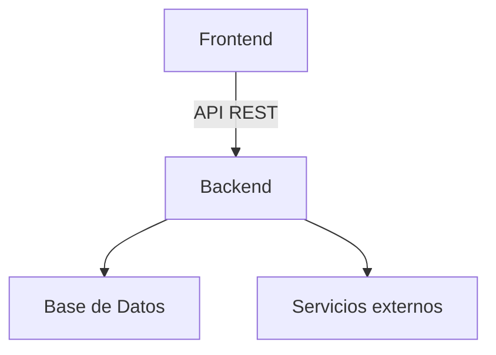
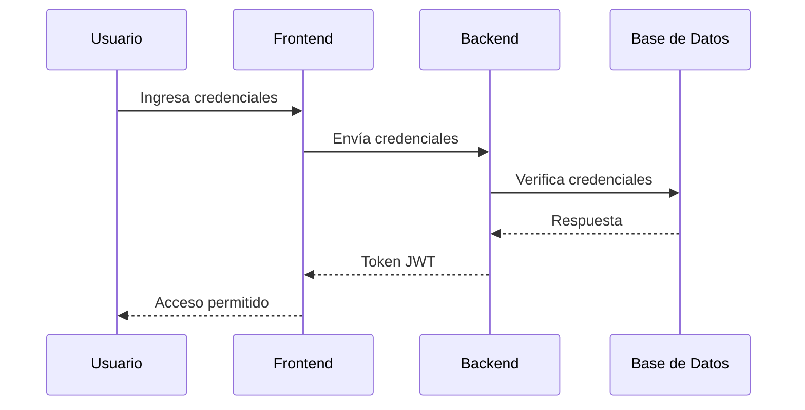
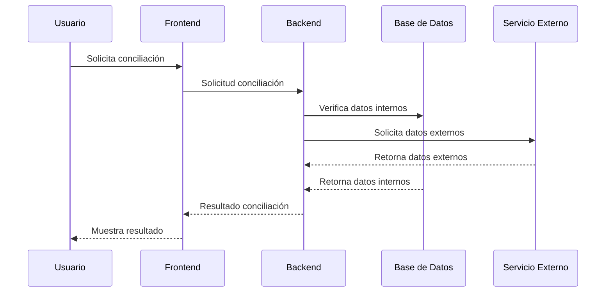

# Diagramas de aplicación

## Diagrama de módulos principales

```mermaid
flowchart TD
    A[Frontend] -->|API REST| B[Backend]
    B --> C[Base de Datos]
    B --> D[Servicios externos]
```

## Diagrama de flujo de autenticación

```mermaid
sequenceDiagram
    participant U as Usuario
    participant F as Frontend
    participant B as Backend
    participant DB as Base de Datos

    U->>F: Ingresa credenciales
    F->>B: Envía credenciales
    B->>DB: Verifica credenciales
    DB-->>B: Respuesta
    B-->>F: Token JWT
    F-->>U: Acceso permitido
```

## Diagrama de flujo para conciliación

```mermaid
sequenceDiagram
    participant U as Usuario
    participant F as Frontend
    participant B as Backend
    participant DB as Base de Datos
    participant S as Servicio Externo

    U->>F: Solicita conciliación
    F->>B: Solicitud conciliación
    B->>DB: Verifica datos internos
    B->>S: Solicita datos externos
    S-->>B: Retorna datos externos
    DB-->>B: Retorna datos internos
    B-->>F: Resultado conciliación
    F-->>U: Muestra resultado
```