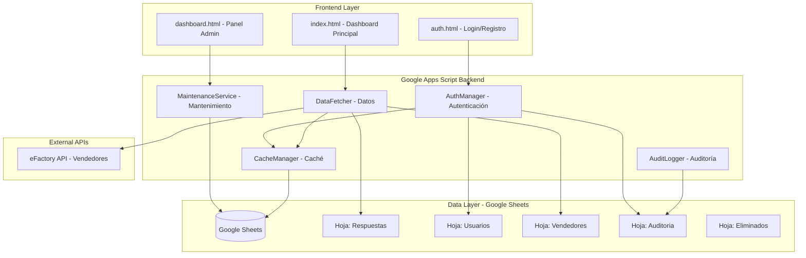
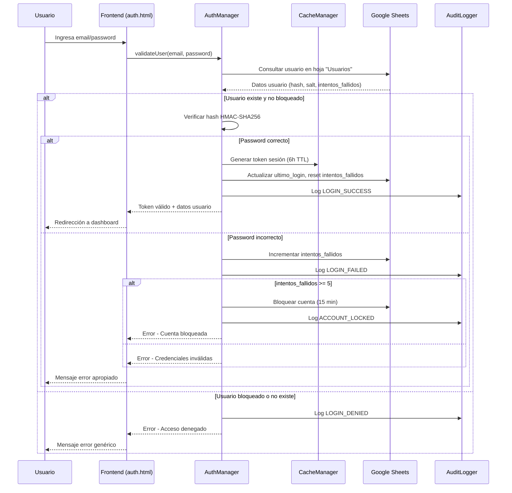
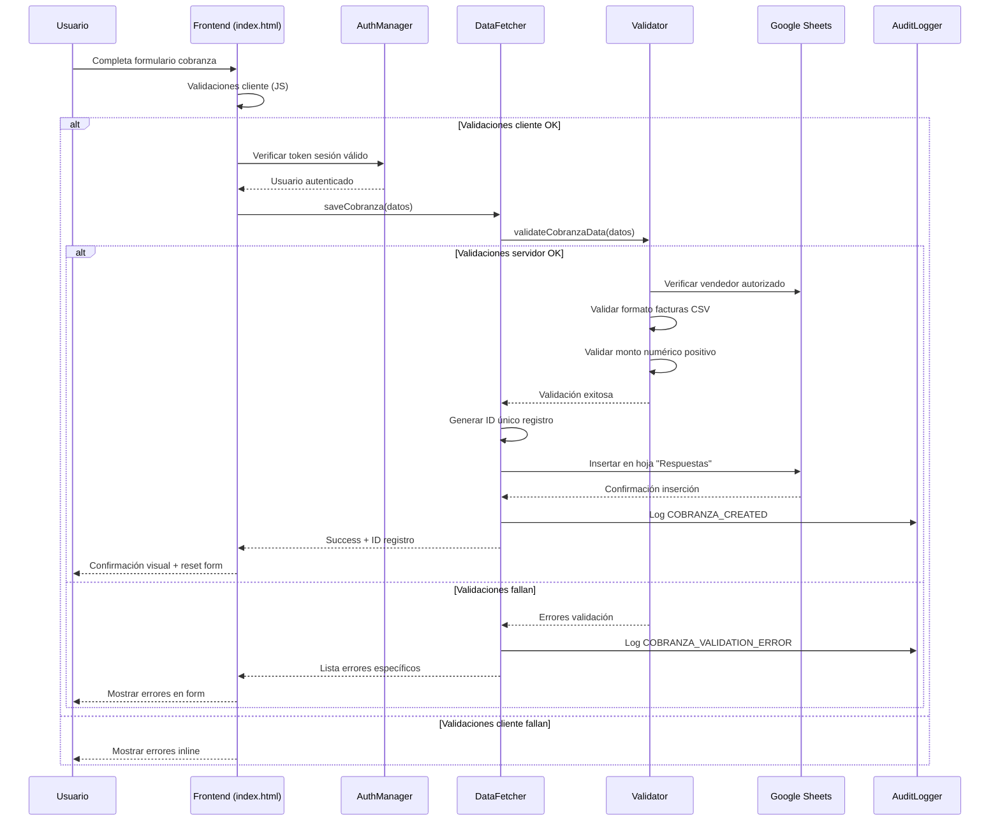
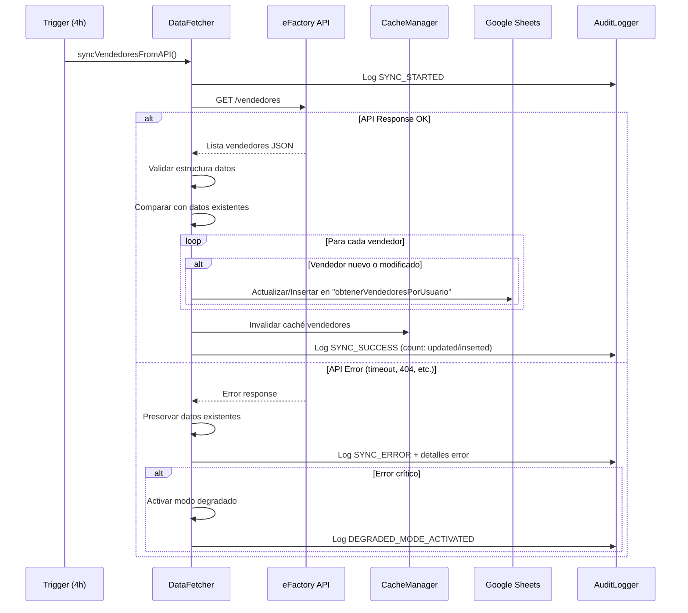
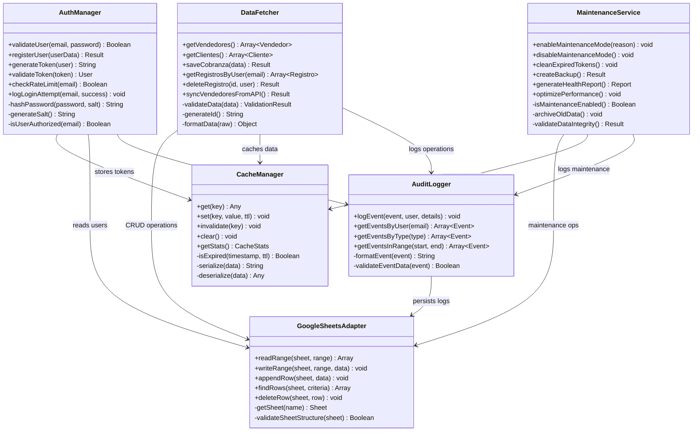
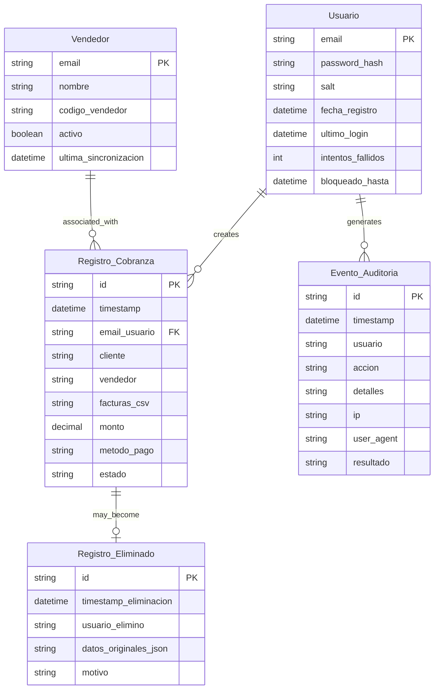
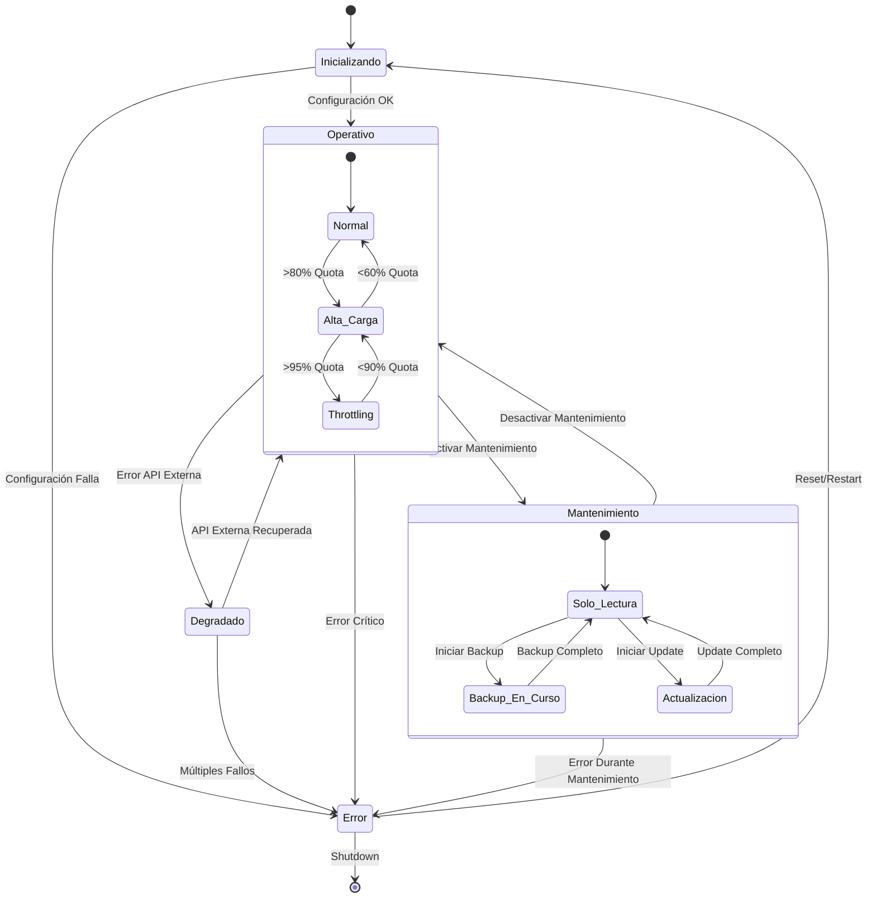
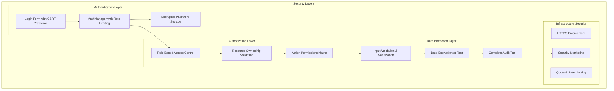
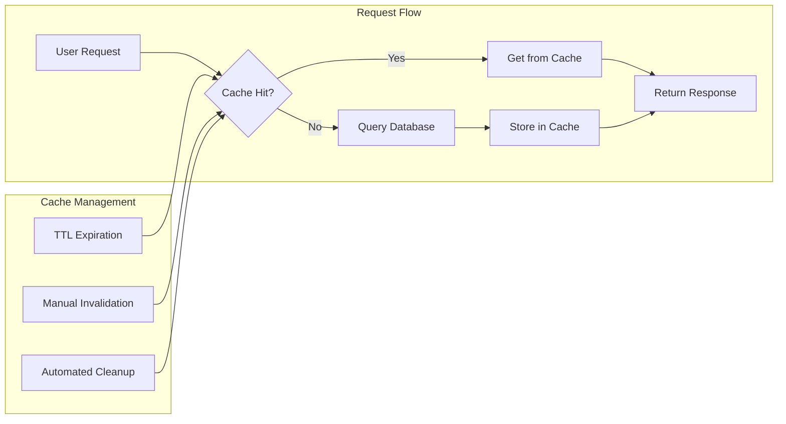
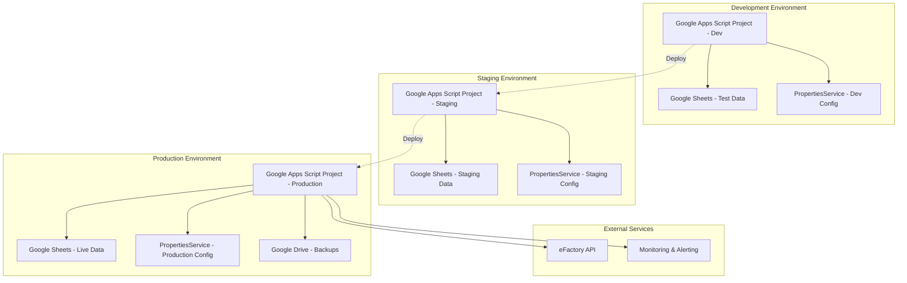

# Diagramas Técnicos - Conciliapp

Este documento contiene los diagramas técnicos que ilustran la arquitectura, flujos de datos y componentes del sistema Conciliapp.

## Diagrama de Arquitectura General

## Flujo de Autenticación Detallado

## Flujo de Registro de Cobranza

## Flujo de Sincronización de Vendedores

## Diagrama de Componentes

## Modelo de Datos (ER-Style)

## Flujo de Estados del Sistema

## Arquitectura de Seguridad

## Flujo de Performance y Caché

## Diagrama de Deployment

## Notas Técnicas

### Leyenda de Diagramas
- **Rectángulos**: Componentes/Servicios
- **Rombos**: Puntos de decisión
- **Cilindros**: Almacenamiento de datos
- **Flechas sólidas**: Flujo de datos/control
- **Flechas punteadas**: Relaciones opcionales/configurables

### Consideraciones de Implementación
- Todos los diagramas reflejan la arquitectura actual en Google Apps Script
- Los flujos incluyen manejo de errores y casos edge
- La seguridad está integrada en cada capa, no como añadido
- El performance está optimizado mediante caché estratégico

### Evolución Futura
- Los diagramas serán actualizados durante la migración a Firestore
- Se añadirán diagramas específicos para microservicios
- La arquitectura de seguridad se expandirá con OAuth2/OIDC
- Se incluirán diagramas de monitoring y observabilidad avanzados